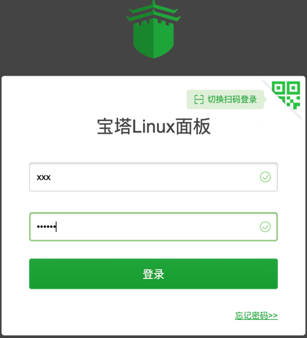
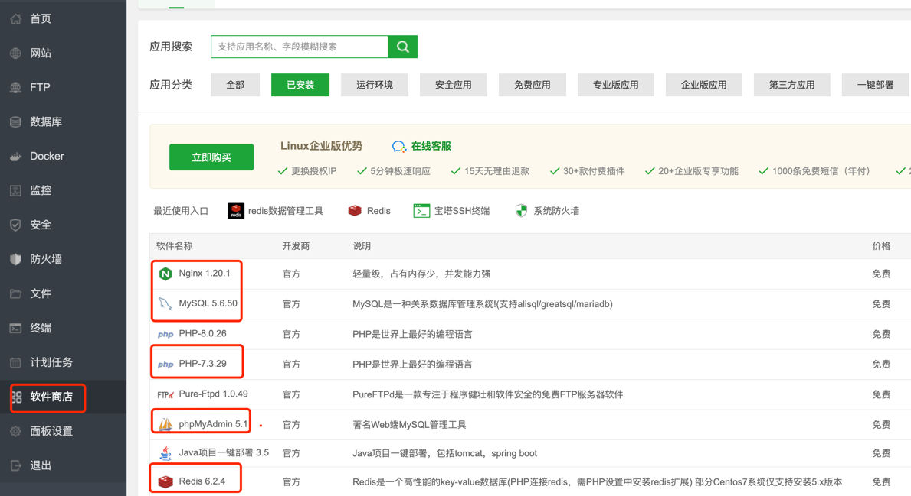

## 环境说明

| 名称               | 版本          | 说明                                                       | 环境                             |
|------------------|-------------|----------------------------------------------------------|--------------------------------|
| 宝塔               | 最新版本        | 运维安装软件服务器监控                                              | 开发环境非必须、生产环境建议安装               |
| JDK              | 1.8         | [JDK压缩包](./soft/jdk-8u211-linux-x64.tar.gz)              | 开发环境必须、生产环境必须                  |
| Mysql            | 5.6-5.7-8.0 | 其他版本没适配                                                  | 开发环境必须、生产环境必须                  |
| Redis            | 7           |                                                          | 开发环境必须、生产环境必须                  |
| Maven            | 3.6.3       | 其他版本没适配                                                  | 开发环境必须、生产环境非必须                 |
| Tomcat           | 9.0.55      | [Tomcat压缩包](./soft/tomcat/apache-tomcat-9.0.55.tar.gz)   | 开发环境非必须、生产环境必须【若改造成jar包部署则非必须】 |
| Nginx            | 1.2x        | 使用宝塔安装                                                   | 开发环境非必须、生产环境建议安装               |
| IDEAJ            | 2022        | Java开发工具，社区版、旗舰版 或者其他工具也是可以的                             | 开发环境建议安装、生产环境非必须               |
| MinIO            | 最新版本        | 安装部署参考[Minio篇](./3、Minio篇.md)                            | 安装一次就行，多个环境可共用                 |
| Nacos            | 2.1.1       | 安装部署参考[Nacos篇](./6、Nacos篇.md)                            | 独立模式                           |


## 1、宝塔安装 【建议安装】【非必须】

官网地址：https://www.bt.cn/new/download.html； 2分钟装好面板，一键管理服务器 集成LAMP/LNMP环境安装，网站、FTP、数据库、文件管理、软件安装等功能

```说明：必须为没装过其它环境如Apache/Nginx/php/MySQL的新系统,推荐使用centos 7.X的系统安装宝塔面板，推荐使用Chrome、火狐、edge浏览器，国产浏览器请使用极速模式访问面板登录地址，如果不确定使用哪个Linux系统版本的，可以使用万能安装脚本，国产龙芯架构CPU安装命令，支持龙芯架构的loongnix 8.x、统信UOS 20、kylin v10系统```

### Centos安装脚本
```shell
yum install -y wget && wget -O install.sh https://download.bt.cn/install/install_6.0.sh && sh install.sh ed8484bec
```

### Ubuntu/Deepin安装脚本

```shell
wget -O install.sh https://download.bt.cn/install/install-ubuntu_6.0.sh && sudo bash install.sh ed8484bec
```


```shell
==================================================================
Congratulations! Installed successfully!
========================面板账户登录信息==========================
 外网面板地址: https://SERVER_IP:33628/a59c5638
 内网面板地址: https://x.x.x.x:33628/a59c5638
 username: x
 password: x

=========================打开面板前请看===========================

 【云服务器】请在安全组放行 33628 端口
 因默认启用自签证书https加密访问，浏览器将提示不安全
 点击【高级】-【继续访问】或【接受风险并继续】访问
 教程：https://www.bt.cn/bbs/thread-117246-1-1.html
 
==================================================================
Time consumed: 2 Minute!

```


## *2、JDK安装

[JDK压缩包](./soft/jdk-8u211-linux-x64.tar.gz)

### Linux/MacOS 安装JDK

在Linux下安装JDK，可以按照以下步骤进行：

1. 下载JDK包：从Oracle官网或者其他信任的来源下载JDK包，例如jdk-8u211-linux-x64.tar.gz。
2. 把JDK文件保存至Linux下目录：通过控制台，使用mkdir命令生成一个目录，例如/usr/local，并把下载的JDK包文件放入该目录下。
3. 解压tar.gz文件：通过控制台，进入/usr/local目录，执行命令tar -zxvf jdk-8u211-linux-x64.tar.gz，将其进行解压。
4. 配置环境变量：编辑Linux的环境变量配置文件，例如vi /etc/profile，在文件的最后添加以下配置内容：JAVA_HOME=/usr/local/jdk1.8.0_111PATH=$JAVA_HOME/bin:$PATHCLASSPATH=.:$JAVA_HOME/lib/dt.jar:$JAVA_HOME/lib/tools.jarexport JAVA_HOMEexport PATHexport CLASSPATH。注意：对应的目录应是你安装JDK的路径。
5. 保存并退出编辑环境变量配置文件之后，需要重新加载配置文件才能使新的环境变量生效。输入命令source /etc/profile。
6. 验证：输入命令java，如有以下配置说明JDK安装成功。

```shell
java version "1.8.0_211"
Java(TM) SE Runtime Environment (build 1.8.0_211-b12)
Java HotSpot(TM) 64-Bit Server VM (build 25.211-b12, mixed mode)
```

如有其他疑问，可以访问Oracle官网或咨询售后人员。

### Windows 安装JDK

Windows下安装JDK有两种方式，可从官网下载JDK安装程序，也可以下载JDK的压缩包解压并自己配置环境变量。
官网下载安装程序步骤为：

1. 在电脑中打开浏览器，在搜索框中输入“Java”关键词，进入Java官网；
2. 在官网页面下滑至【下载与安装】模块处，点击【Java下载】；
3. 在下载页面中，点击下载链接进行下载；
4. 下载完成后，打开下载文件的安装包进行安装。

压缩包安装步骤为：

1. 找到想要安装版本的JDK压缩包，解压到本地；
2. 打开Windows的环境变量设置；
3. 在环境变量设置中配置以下变量 ：新建变量名JAVA_HOME 变量值为解压的jdk的安装路径。
4. 打开cmd命令窗口验证：输入命令java，如有以下配置说明JDK安装成功。

## *3、部署宝塔安装 Mysql、PHP7、Nginx、Redis、phpMyAdmin安装

【生产环境强烈推荐】
使用宝塔直接安装Mysql5.6，操作步骤如下：

1、在浏览器地址栏输入宝塔外网面板地址: https://SERVER_IP:33628/a59c5638，登录界面输入用户名密码。
进入后输入，宝塔实名认证的账户密码。


2、然后界面会弹出环境软件界面，可以选择安装Mysql版本5.6，PHP7.3，Nginx版本1.22，phpMyAdmin 版本4.9
安装完成后，在软件商店已安装部分出现。红色框框的都需要安装。


```text
说明：如果登录宝塔没有弹出软件安装界面，那么请点击宝塔左侧菜单"软件商店" - 依次搜索 Mysql、PHP7、Nginx、Redis、phpMyAdmin 并选择本文推荐的软件版本进行安装。
```


## * 4、Zookeeper 安装 

[zookeeper压缩包](./soft/apache-zookeeper-3.7.1-bin.tar.gz)

ZooKeeper的安装步骤如下：
1. 需要安装JDK 7或更高版本。
2. 下载ZooKeeper并解压安装包。
3. 配置启动。进入到conf目录拷贝一个zoo_sample.cfg 重命名 zoo.cfg 并完成配置。
4. 启动ZooKeeper。进入到bin目录启动./zkServer.sh start。
5. 如有需要，可以通过命令行查看ZooKeeper状态 ./zkServer.sh status

```shell
ooKeeper JMX enabled by default
Using config: /usr/local/apache-zookeeper-3.7.1-bin/bin/../conf/zoo.cfg
Client port found: 2181. Client address: localhost. Client SSL: false.
Mode: standalone
```

## 5、Tomcat 安装

```markdown
千万不要使用宝塔的软件商店中的tomcat版本！
千万不要使用宝塔的软件商店中的tomcat版本！
千万不要使用宝塔的软件商店中的tomcat版本！
```

[Tomcat压缩包](./soft/tomcat/apache-tomcat-9.0.55.tar.gz)

Linux下安装Tomcat可以按照以下步骤进行：

1. 将软件包导入到Linux中。在Linux的/usr/local/src下建立tomcat目录，使用FileZilla软件，将Windows中的tomcat软件包导入。
2. 到目录下解压tomcat压缩包，可以同时将其重命名为tomcat。
3. 启动Tomcat服务器。进入tomcat目录查看；查看tomcat下bin下目录，有一个启动的文件：startup.sh；启动tomcat服务器：./bin/startup.sh（4）在浏览器输入IP:8080，发现不能成功访问。输入查看端口的命令：/etc/rc.d/init.d/iptablesstatus，发现8080端口未开放。
4. 要使刚配置的端口生效，则需要重启防火墙，输入命令service iptables restart。至此，tomcat测试页面应该可以成功进行访问了。
5. 关闭tomcat ./shutdown.sh或sh shutdown.sh kill -9 进程号。


注意：
1、修改tomcat_home/conf/catanina.properties 第108行；或下载 [catanina.properties](./soft/tomcat/catalina.properties)  替换线上TOMCAT_HOME/conf/目录下面的对应文件。
```properties
tomcat.util.scan.StandardJarScanFilter.jarsToSkip=*.jar
```
2、修改tomcat_home/conf/sever.xml
```xml
 <!-- port 端口必须要跟 yml文件里面的port端口一致 否则一定会报错，访问不到接口 404 之类的错误 -->
 <Connector port="18001" protocol="HTTP/1.1"
               connectionTimeout="20000"
               redirectPort="8443" />
```

如果是所有的服务都购买了那么需要最少三个tomcat来部署。

以上内容仅供参考。实际操作可能因Linux系统版本不同、软件包版本不同而产生变化，如果遇到问题建议咨询专业技术人员。

## 6、Minio 非必须安装 

见附件 [Minio篇](./3、Minio篇.md)
