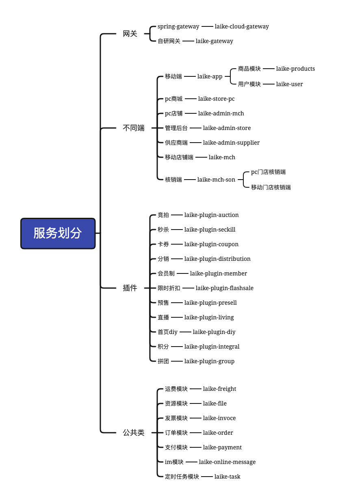
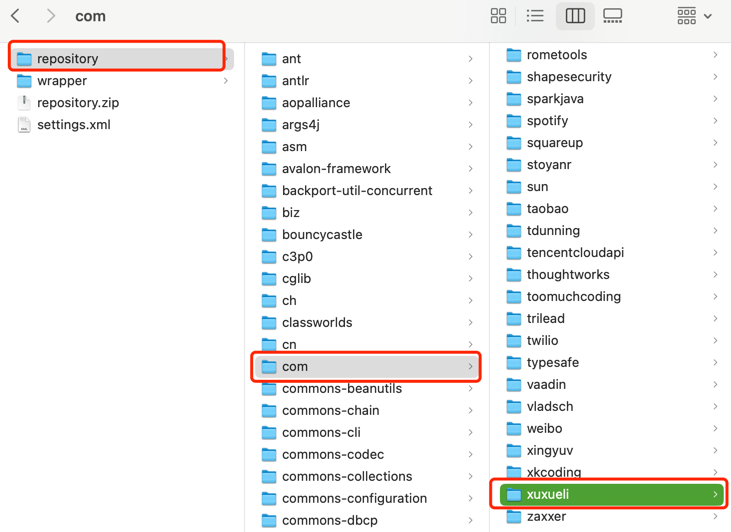
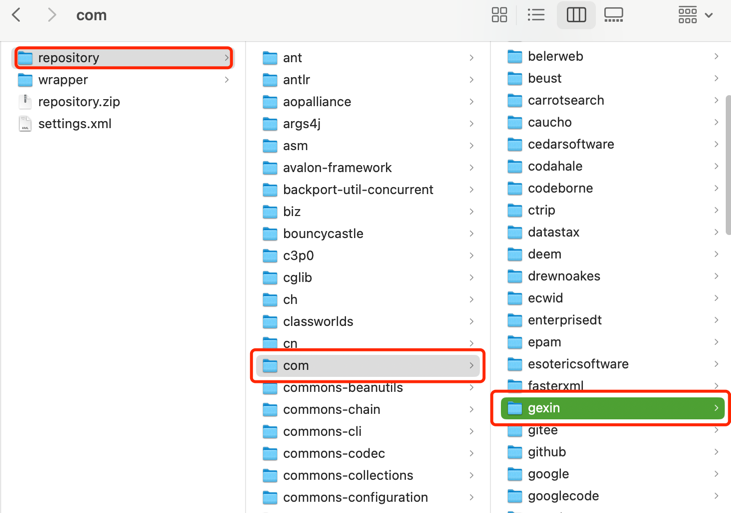

<!-- TOC -->
  * [来客电商商城整体架构：多商城多店铺](#来客电商商城整体架构多商城多店铺)
  * [环境软件版本说明](#环境软件版本说明)
  * [接口整体技术栈](#接口整体技术栈)
    * [1、配置好Maven 建议使用3.6.3版本](#1配置好maven-建议使用363版本)
    * [2、Mysql和Redis配置](#2mysql和redis配置)
        * [A-数据库配置](#a-数据库配置)
        * [B-Redis配置](#b-redis配置)
        * [C-本地图片上传路径配置](#c-本地图片上传路径配置)
        * [D-微信支付证书保存路径配置](#d-微信支付证书保存路径配置)
    * [3、Dubbo配置](#3dubbo配置)
        * [Dubbo服务注册配置](#dubbo服务注册配置)
    * [4、多环境配置说明](#4多环境配置说明)
    * [5、打开idea的Service视图窗口](#5打开idea的service视图窗口)
    * [6、网关laike-gateway](#6网关laike-gateway)
    * [7、数据库更新脚本说明](#7数据库更新脚本说明)
    * [8、Tomcat端口的配置](#8tomcat端口的配置)
    * [9、导出Excel文件](#9导出excel文件)
    * [10、lib说明](#10lib说明)
      * [10.1授权包](#101授权包)
        * [10.1.1使用说明](#1011使用说明)
      * [10.2支付宝退款错误jar版本，非必须操作](#102支付宝退款错误jar版本非必须操作)
      * [10.3其他第三方jar，非必须操作](#103其他第三方jar非必须操作)
      <!-- TOC -->

## 来客电商商城整体架构：多商城多店铺

```markdown

平台 [LaiKeAdminViews-总平台端]  
├── 商城1[LaiKeAdminViews-商城管理端、LaiKeMallViews-PC商城端、LaiKePages-移动端]   
│   ├── 自营店  [PC端店铺-LaiKeMchViews、移动端店铺-LaiKePages]
│   │   ├── 门店1【门店用来定位与[核销、自提]】
│   │   ├── ...
│   │   └── 门店N
│   └── 其他店铺 [PC端店铺-LaiKeMchViews、移动端店铺-LaiKePages]
│   │   └── 门店1
│   └── 商城供应商 [ LaiKeSupplierViews-PC供应商端 ]
│   │   ├── 供应商1
│   │   ├── ...
│   │   └── 供应商N [lkt_supplier]
├── |--用户【买家】[lkt_user] 
├── 商城2   
│   ├── 自营店 [PC端店铺-LaiKeMchViews、移动端店铺-LaiKePages]
│   │   ├── 门店1【 门店用来定位与[核销、自提] 】
│   │   ├── ...
│   │   └── 门店N[pc端：LaiKeMchSonViews 移动端：LaiKeMchSonPages]
├── 商城3    
│   ├── 自营店  [PC端店铺-LaiKeMchViews、移动端店铺-LaiKePages]
│   └── 商城供应商 [ LaiKeSupplierViews-PC供应商端 ]
│   │   ├── 供应商1
│   │   ├── ...
│   │   └── 供应商N

```
商城整体是类似京东、淘宝多商城多店铺结构的商城;不同商城之间用商城字段隔离数据；

## 环境软件版本说明

| 名称        | 版本      | 说明                                 |
|-----------|---------|------------------------------------|
| JDK       | 1.8-211 | 其他版本没适配                            |
| Mysql     | 5.6-5.7 | 其他版本没适配                            |
| Redis     | 7       |                                    |
| Maven     | 3.6.1   |                                    |
| Tomcat    | 9.0.55  | 其他版本没适配                            |
| Nacos     | 2.1.1   | 其他版本没适配                            |
| Seata     | 1.6.1   | 其他版本没适配                            |

## 接口整体技术栈

| 名称                                   | 版本            | 说明      |
|--------------------------------------|---------------|---------|
| SpringBoot【新版本】                      | 2.3.12        |         |
| Dubbo                                | 3.0.8         |         |
| tk-Mybatis                           | 2.1.5         | 持久层     |
| Fastjson                             | 1.2.83        |         |
| Minio                                | 8.5.4         |         |
| OKhttp3                              | 4.8.1         |         |
| spring-cloud                         | Hoxton.SR12   |         |
| spring-cloud-alibaba                 | 2.2.7.RELEASE |         |
| spring-cloud-gateway                 | 2.2.9.RELEASE |         |
| spring-cloud-alibaba-nacos-config    | 2.2.9.RELEASE |         |
| spring-cloud-alibaba-nacos-discovery | 2.2.9.RELEASE |         |
| seata                                | 1.6.1         |         |
| sentinal                             | 0.9.1         |         |

## 服务划分


### 1、配置好Maven 建议使用3.6.1版本

把Maven设置成3.6.1 [其他Maven版本未适配]，将邮件中m2文件夹里面的laike-root-0.0.1-SNAPSHOT.jar ；使用安装命令安装到本地maven仓库，安装脚本如下：

```shell
# 说明：
# 1、-Dfile=root的所在具体文件绝对路径
# 2、mvn 命令在 maven_home/bin 目录下执行或者配置全局环境变量
mvn install:install-file -Dfile=/path/laike-root-0.0.1-SNAPSHOT.jar -DgroupId=com.laiketui -DartifactId=laike-root -Dversion=0.0.1-SNAPSHOT -Dpackaging=jar
```
有时候其他某些模块也下载不到，那么请到企微群中索要Maven库的资源信息。
配置好Maven后执行多次 Clean操作 和 Reload操作 

### 2、Mysql和Redis配置

`配置都在Nacos-配置中心中设置` 主要修改的配置信息在以下文件中

```ini 
common-dev.yml 开发服务器环境配置信息
common-local.yml 本地环境配置信息
common-prod.yml 正式环境配置信息
common-demo.yml 演示环境配置信息
common-test.yml 测试环境配置信息
```
 ##### A-数据库配置 
```yaml
  datasource:
    driver-class-name: com.mysql.cj.jdbc.Driver 
    url: jdbc:mysql://数据库服务器IP:数据库端口/数据库名?useUnicode=true&autoReconnect=true&characterEncoding=utf-8&serverTimezone=GMT%2B8&zeroDateTimeBehavior=convertToNull&tinyInt1isBit=false
    username: 数据库用户名
    password: 数据库用户对应密码 
  #    url: jdbc:mysql://localhost:3306/test_db?useUnicode=true&autoReconnect=true&characterEncoding=utf-8&serverTimezone=GMT%2B8&zeroDateTimeBehavior=convertToNull&tinyInt1isBit=false
  #    username: root
  #    password: root
```
##### B-Redis配置
`Redis配置信息也在laike-core模块中的`
```yaml
  redis:
    host: ${REDIS_HOST:localhost}   # REDIS_HOST为本地研发配置的环境变量，如果不需要可以忽略或者删除
    port: ${REDIS_PORT:6379}        # REDIS_PORT为本地研发配置的环境变量，如果不需要可以忽略或者删除
    password: ${REDIS_PWD:laiketui} # REDIS_PWD为本地研发配置的环境变量，如果不需要可以忽略或者删除
    lettuce:
      pool:
        # 连接池中的最大空闲连接 默认8
        max-idle: 100
        # 连接池中的最小空闲连接 默认0
        min-idle: 0
        # 连接池最大连接数 默认8 ，负数表示没有限制
        max-active: 20
        # 连接池最大阻塞等待时间（使用负值表示没有限制） 默认-1
        max-wait: -1
    timeout: 30000
    database: ${REDIS_DB:0}         # 指定Redis数据库序号：默认0，【0-15】可配，REDIS_DB为本地研发配置的环境变量，如果不需要可以忽略或者删除
```

##### C-本地图片上传路径配置

在Nacos的配置中心，data-id为laike-admin-store-{active-profile}.yml

```yaml
#文件上传路径
uploadFile:
  path: ${UPLOAD_PATH:/usr/local/imgs} # UPLOAD_PATH：是开发环境开发工具配置的路径
```

_本地图片上传之后,需要配置类似nginx代理访问本地图片_

```textmate

#静态资源库
location /images {
    alias  /usr/local/imgs/; # 和配置文件中的path保持一致
}

```

##### D-微信支付证书保存路径配置

在Nacos的配置中心，data-id为laike-admin-store-{active-profile}.yml

```yaml
node:
  # 微信p12证书保存位置：不同的操作系统需要修改保存的位置 需要读写权限
  #  wx-certp12-path: D:/server
  wx-certp12-path: /var/pay/
```

### 3、Dubbo配置

注：确保有能使用的zookeeper 3.7.10 服务，端口2181 `如果zookeeper安装在本地则默认不需要修改任务dubbo的配置信息，`

##### Dubbo服务注册配置

在子模块资源文件夹中的laike-xxx-{active-profile}.yml / laike-plugin-xxx-{active-profile}.yml
配置文件dubbo配置节点，需要配置的项在下面的yml中有注释说明。

【==新版弃用==】

```yaml
dubbo:
  application:
    name: laike-coupon
  registry:
    id: zookeeper-registryapplication.yml
    protocol: zookeeper
    address: 127.0.0.1:2181 # 【zookeeper的服务器所在地址和端口】 
  protocol:
    name: dubbo
    port: 21894 #【必须唯一，若被占用则需要更换】
    accesslog: dubbo-access.log
  provider:
    retries: 0
    timeout: 600000
    delay: -1
    filter: -exception,dubboExceptionFilter
  monitor:
    protocol: registry
```

【==新版弃用==】

新版dubbo配置：

```yaml 
# Nacos 注册中心
dubbo:
  application:
    name: laike-user
    # 禁用QOS同一台机器可能会有端口冲突现象
    qos-enable: false
    qos-accept-foreign-ip: false
    # 配置注册中心
  registry:
    address: nacos://IP:PORT
    parameters: laike-dubbo-nacos
  # 设置超时时间
  consumer:
    timeout: 6000
  protocol:
    name: dubbo
    port: ${NACOS_PORT:21889} 
```

### 4、多环境配置说明

项目有多个环境的配置文件,可以在Maven工具插件界面切换环境配置文件，切换后需要多次执行 Maven的 Clean命令和Complie命令、 Reload Project 来刷新配置文件，有时候编辑器工具会有很严重的缓存问题。

### 5、打开idea的Service视图窗口

在窗口中启动相关服务。启动前前先编辑应用的启动配置。启动后访问网关服务，在浏览器输入： http://lcoalhost:18001/gw 出现下面的说明已经网关启动成功了
```markdown
{"code":"5003","message":"异常请求","data":null}
```

### 6、网关laike-gateway

- <u>网关必须要启动，除了IM和支付回调没有经过网关，其他的接口调用都通过网关调用。</u>
- 网关的作用目前主要是对前端请求进行分发负载、记录请求参数和处理返回结果等功能。
- 网关

### 7、数据库更新脚本说明

- 数据库的更新脚本位于 PROJECT_ROOT/db_logs目前下面。
- 数据库的表结构变更脚本请记录在这个文件夹下面，
- 更新脚本文件名的命名规则为：年月日_姓名字母拼音首字母小写.sql ，同一个人同一天用同一个文件记录
  <u>如：张三2023年8月8日更新过数据库表结构则，更新脚本文件命名为:20230808_zs.sql</u>

### 8、Tomcat端口的配置

- 本地开发调试时使用的端口根据yml环境的配置使用具体环境配置的端口；环境分三种：dev、local、prod
- 线上部署的时候Tomcat的配置文件server.xml中的配置端口必须要和打包时所选的端口一致才能被正常访问，否则会出现404，或者服务未启动等错误信息。
- 如果子模块：xxxx 中的 YML_PORT =
  18001；那么打包后的war部署的tomcat的server.xml中的端口TOMCAT_SERVER_XML_PORT也要等于YML_PORT，即：TOMCAT_SERVER_XML_PORT=18001。

   ```yaml
   server:
    port: ${tomcat_port:18001}
   ```
   `Tomcat配置文件server.xml的 TOMCAT_SERVER_XML_PORT=18001`
   ```xml
    <Connector port="18001" protocol="HTTP/1.1" connectionTimeout="20000" redirectPort="8443"/>
   ```

### 9、导出Excel文件

PC端导出请求，必须带exportType = 1 请求参数,实例如下：
```javascript
async exportPage() {
    
      //导出当前页面
      await exports(
        {
          api: "admin.goods.getBrandInfo",
          pageNo: this.dictionaryNum,
          pageSize: this.pageSize,
          exportType: 1,
          brandName: this.inputInfo.name,
        },
        "pagegoods"
      );
    }

    //导出所有
    async exportAll() {
      console.log(this.total);
      await exports(
        {
          api: "admin.goods.getBrandInfo",
          pageNo: 1,
          pageSize: this.total,
          exportType: 1,
          brandName: this.inputInfo.name,
        },
        "allgoods"
      );
    }

    //导出查询结果
    async exportQuery() {
      await exports(
        {
          api: "admin.goods.getBrandInfo",
          pageNo: 1,
          pageSize: this.total,
          exportType: 1,
          brandName: this.inputInfo.name,
        },
        "querygoods"
      );
    }
  }
```

java接口返回必须是return null 等价于 return Result.exportFile()
```java
 @ApiOperation("库存列表")
    @PostMapping("/getStockInfo")
    @HttpApiMethod(apiKey = "admin.goods.getStockInfo")
    public Result getStockInfo(StockInfoVo vo, HttpServletResponse response) {
        try {
            Map<String, Object> ret = stockService.getStockInfo(vo, response);
            return ret == null ? Result.exportFile() : Result.success(ret);
        } catch (LaiKeAPIException e) {
            return Result.error(e.getCode(), e.getMessage());
        }
    }
```

```javascript
// 导出
export const exports = (params,fileName) => {
    return request({
        method: 'post',
        params: params,
    }).then(res => {
        console.log(res);
      let blob = new Blob([res.data], {type: 'application/actet-stream;charset=utf-8'})
        if ('download' in document.createElement('a')) { // 非IE下载
            const elink = document.createElement('a')
            elink.download = fileName + '-' + res.data.size + '.xls'
            elink.style.display = 'none'
            elink.href = URL.createObjectURL(blob)
            document.body.appendChild(elink)
            elink.click()
            URL.revokeObjectURL(elink.href) // 释放URL 对象
            document.body.removeChild(elink)
        } else { // IE10+下载
            navigator.msSaveBlob(blob, fileName + '-' + res.data.size + '.xls')
        }
    })
}

export const exportss = (params,fileName) => {
    return request({
        method: 'post',
        params: params,
    }).then(res => {
        console.log(res);
      let blob = new Blob([res.data], {type: 'application/actet-stream;charset=utf-8'})
        if ('download' in document.createElement('a')) { // 非IE下载
            const elink = document.createElement('a')
            elink.download = fileName + '-' + res.data.size + '.zip'
            elink.style.display = 'none'
            elink.href = URL.createObjectURL(blob)
            document.body.appendChild(elink)
            elink.click()
            URL.revokeObjectURL(elink.href) // 释放URL 对象
            document.body.removeChild(elink)
        } else { // IE10+下载
            navigator.msSaveBlob(blob, fileName + '-' + res.data.size + '.zip')
        }
    })
}

```

### 10、lib说明

附件文件里面出现的
#### 10.1授权包
```text
laike-root-0.0.1-SNAPSHOT.jar 
```
##### 10.1.1使用说明
1、拷贝laike-root-0.0.1-SNAPSHOT.jar 到本地maven仓库 位置：
```text
MAVEN_HOME/repository/com/laiketui/laike-root/0.0.1-SNAPSHOT/laike-root-0.0.1-SNAPSHOT.jar
```
2、使用mvn install 命令安装到本地maven仓库，命令如下：
```shell
# -Dfile root的实际文件位置，执行命令前需要修改Dfile的具体位置。
mvn install:install-file -Dfile=laike-root-0.0.1-SNAPSHOT.jar的文件位置 -DgroupId=com.laiketui -DartifactId=laike-root -Dversion=0.0.1-SNAPSHOT -Dpackaging=jar
```

#### 10.2支付宝退款错误jar版本，非必须操作
如果没有支付宝的支付方式可以不使用这个jar
```text
tea-1.2.7.jar 说明：升级okhttp3后需要使用此版本的jar 来适配支付宝的退款接口调用。
```

#### 10.3其他第三方jar，非必须操作
以下两个zip包一般是本地打包下载maven依赖不到的时候才需要使用lib包中的压缩包；直接解压的方式，解压后放到本地maven仓库中。

```text 
xuxueli.zip 
```


```text
gexin.zip    
```



#### 10.4 订单售后按钮说明

* refund：申请售后;
* refundAmt：仅退款 只有代发货才有仅退款
* refundAmtBtn：申请退款按钮 如果订单完成了则显示 售后按钮 否则显示退款按钮 俩按钮只有文字上的区别;插件只显示申请售后按钮
* refundGoods：换货 未发货没有换货 订单两次换货成功后不能再换货
* refundGoodsAmt：退货退款 未发货没有退货退款
* refundShowBtn：查看售后按钮 有售后记录的就显示


#### 10.5 订单状态-status-值：
*  0：待付款
*  1：已付款
*  2：待收货
*  5：订单完成 ：未结算、未完成售后
*  7：订单关闭 ：已结算，已过售后
