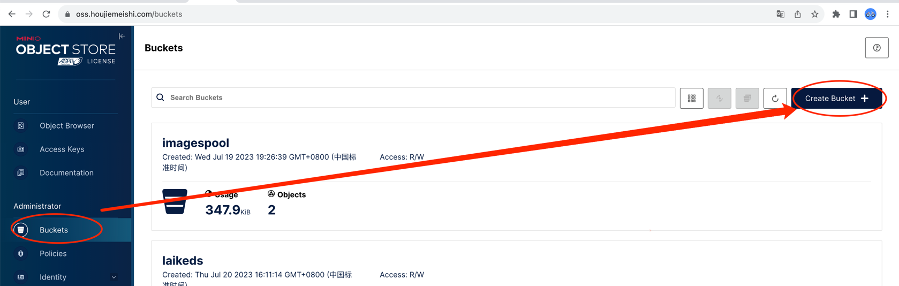
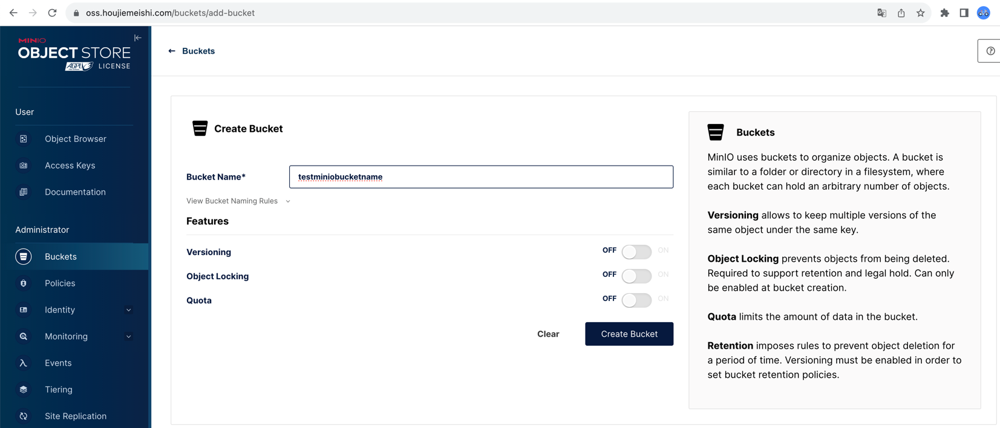
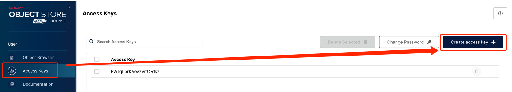
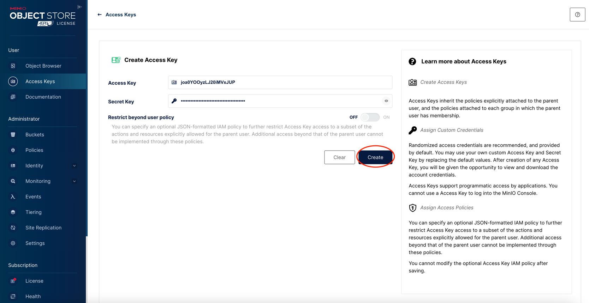
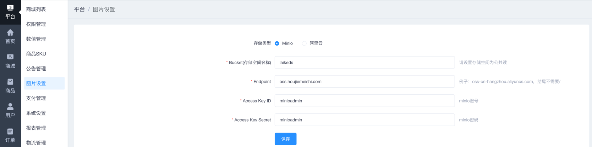

MinIO 官网 ：https://min.io/

### 1、docker安装Minio


_MINIO_ACCESS_KEY 不低于8个字符 ; MINIO_SECRET_KEY 不低于8个字符_


```SSH

docker run -d \
  --name minio \
  --restart=always \
  -p 9018:9000 \
  -p 9090:9090 \
  -v /opt/metersphere/data/minio:/data \
  -e "MINIO_ROOT_USER=adminminio" \
  -e "MINIO_ROOT_PASSWORD=adminminio" \
  minio/minio server /data \
    --console-address ":9090" \
    --address ":9000"
```

### 2、 通过Nginx 配域名和https
https://min.io/docs/minio/linux/integrations/setup-nginx-proxy-with-minio.html

线上例子：
```nginx
server
{
    listen 80;
	listen 443 ssl http2;
    server_name oss.houjiemeishi.com;
    index index.php index.html index.htm default.php default.htm default.html;
    root /www/wwwroot/oss.houjiemeishi.com;

    #SSL-START SSL相关配置，请勿删除或修改下一行带注释的404规则
    #error_page 404/404.html;
    ssl_certificate    /www/server/panel/vhost/cert/oss.houjiemeishi.com/fullchain.pem;
    ssl_certificate_key    /www/server/panel/vhost/cert/oss.houjiemeishi.com/privkey.pem;
    ssl_protocols TLSv1.1 TLSv1.2 TLSv1.3;
    ssl_ciphers EECDH+CHACHA20:EECDH+CHACHA20-draft:EECDH+AES128:RSA+AES128:EECDH+AES256:RSA+AES256:EECDH+3DES:RSA+3DES:!MD5;
    ssl_prefer_server_ciphers on;
    ssl_session_cache shared:SSL:10m;
    ssl_session_timeout 10m;
    add_header Strict-Transport-Security "max-age=31536000";
    error_page 497  https://$host$request_uri;
	#SSL-END 
    

    #PHP-INFO-START  PHP引用配置，可以注释或修改
    include enable-php-73.conf;
    #PHP-INFO-END 
    
    #REWRITE-START URL重写规则引用,修改后将导致面板设置的伪静态规则失效
    include /www/server/panel/vhost/rewrite/oss.houjiemeishi.com.conf;
    #REWRITE-END

    #禁止访问的文件或目录
    location ~ ^/(\.user.ini|\.htaccess|\.git|\.env|\.svn|\.project|LICENSE|README.md)
    {
        return 404;
    }

    #一键申请SSL证书验证目录相关设置
    location ~ \.well-known{
        allow all;
    }

    #禁止在证书验证目录放入敏感文件
    if ( $uri ~ "^/\.well-known/.*\.(php|jsp|py|js|css|lua|ts|go|zip|tar\.gz|rar|7z|sql|bak)$" ) {
        return 403;
    } 
    
    #绑定域名 这是单独域名访问 minio
    location / {
        proxy_pass http://localhost:9090/;  
        proxy_http_version 1.1;    
        proxy_set_header Upgrade $http_upgrade;    
        proxy_set_header Connection "Upgrade";    
        proxy_set_header X-real-ip $remote_addr;
        proxy_set_header X-Forwarded-For $remote_addr; 
        proxy_set_header Origin '';
        chunked_transfer_encoding off;
    }
    
    # MinIO 控制台代理 这是和网关公用域名
    location /minio/ {
        proxy_pass http://127.0.0.1:9090/;
        proxy_http_version 1.1;
    
        proxy_set_header Upgrade $http_upgrade;
        proxy_set_header Connection "Upgrade";
        proxy_set_header Host $host;
        proxy_set_header X-Real-IP $remote_addr;
        proxy_set_header X-Forwarded-For $proxy_add_x_forwarded_for;
        proxy_set_header X-Forwarded-Proto $scheme;
    
        sub_filter_types text/html;
        sub_filter 'href="/' 'href="/minio/';
        sub_filter 'src="/' 'src="/minio/';
        sub_filter_once off;
    }
    
    #域名图片访问
    location /your-bucket-name {
        proxy_pass http://47.107.123.240:9018/your-bucket-name;  
        proxy_http_version 1.1;    
        proxy_set_header Upgrade $http_upgrade;    
        proxy_set_header Connection "Upgrade";    
        proxy_set_header X-real-ip $remote_addr;
        proxy_set_header X-Forwarded-For $remote_addr;
        
    }  
    access_log  /www/wwwlogs/oss.houjiemeishi.com.log;
    error_log  /www/wwwlogs/oss.houjiemeishi.com.error.log;
}
```

### 3、配置Minio Bucket




### 4、配置密钥




### 5、配置商城后台 平台 - 图片设置 MinIO 设置

根据前面创建的bucketname和用户和密钥 填写商城后MinIO信息



## 使用mc工具，修改minio的桶访问策略

```shell
# 安装 mc（如未安装）
curl -O https://dl.min.io/client/mc/release/linux-amd64/mc
chmod +x mc
```

### 配置别名
```shell
./mc alias set myminio http://localhost:9018 adminminio adminminio
```

### 尝试执行管理员命令
```shell
./mc admin info myminio
```

### 修改访问策略脚本 ！！！！！！！！！！！！！！！
```shell
 #your-bucket-name 改成你在minio控制台创建的bucket名称
./mc anonymous set public myminio/your-bucket-name 

```


